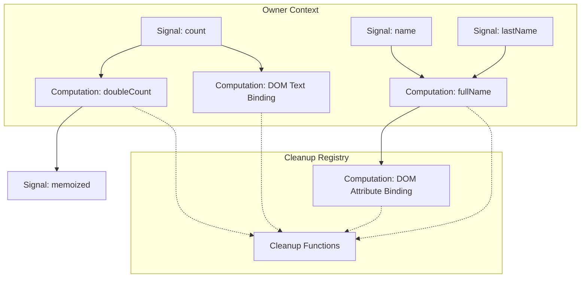
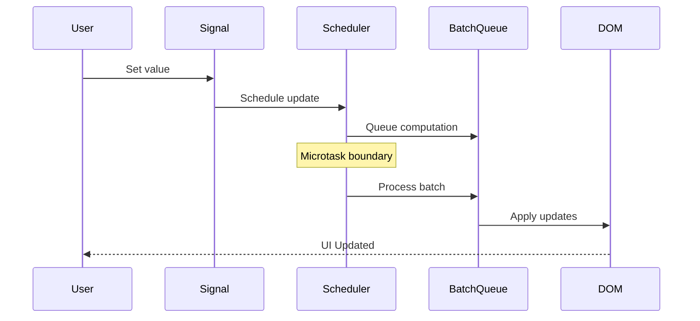
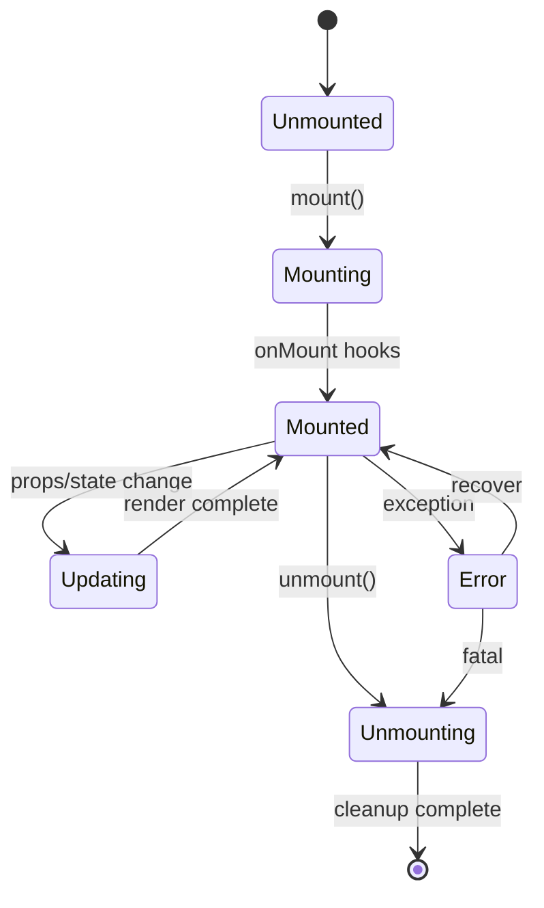

# Golid Reactivity System Implementation Roadmap

## Overview

This document provides a detailed implementation roadmap for the SolidJS-inspired reactivity system, including code examples, technical diagrams, and step-by-step migration strategies.

---

## Technical Architecture Diagrams

### 1. Signal Dependency Graph



### 2. Update Batching Flow



### 3. Component Lifecycle State Machine



---

## Detailed Implementation Examples

### 1. Core Signal Implementation

```go
// signals_v2.go
package golid

import (
    "sync"
    "sync/atomic"
    "syscall/js"
)

var signalIdCounter uint64

type Signal[T any] struct {
    id          uint64
    value       T
    subscribers map[uint64]*Computation
    owner       *Owner
    compareFn   func(prev, next T) bool
    mutex       sync.RWMutex
}

func CreateSignal[T any](initial T, options ...SignalOptions[T]) (*Signal[T], func(T)) {
    s := &Signal[T]{
        id:          atomic.AddUint64(&signalIdCounter, 1),
        value:       initial,
        subscribers: make(map[uint64]*Computation),
        owner:       getCurrentOwner(),
    }
    
    // Apply options
    if len(options) > 0 {
        opt := options[0]
        if opt.Equals != nil {
            s.compareFn = opt.Equals
        }
        if opt.Owner != nil {
            s.owner = opt.Owner
        }
    }
    
    // Register with owner for cleanup
    if s.owner != nil {
        s.owner.registerSignal(s)
    }
    
    // Return getter and setter
    getter := func() T {
        return s.Get()
    }
    
    setter := func(value T) {
        s.Set(value)
    }
    
    return s, setter
}

func (s *Signal[T]) Get() T {
    // Track dependency if we're in a computation context
    if comp := getCurrentComputation(); comp != nil {
        s.subscribe(comp)
        comp.addDependency(s)
    }
    
    s.mutex.RLock()
    defer s.mutex.RUnlock()
    return s.value
}

func (s *Signal[T]) Set(value T) {
    s.mutex.Lock()
    
    // Check if value actually changed
    if s.compareFn != nil {
        if s.compareFn(s.value, value) {
            s.mutex.Unlock()
            return
        }
    }
    
    s.value = value
    subscribers := make([]*Computation, 0, len(s.subscribers))
    for _, comp := range s.subscribers {
        subscribers = append(subscribers, comp)
    }
    s.mutex.Unlock()
    
    // Schedule updates in batch
    if len(subscribers) > 0 {
        scheduler.batch(func() {
            for _, comp := range subscribers {
                comp.markDirty()
            }
        })
    }
}
```

### 2. Effect System Implementation

```go
// effects_v2.go
package golid

var computationIdCounter uint64
var currentComputation *Computation

type Computation struct {
    id           uint64
    fn           func()
    dependencies map[uint64]Dependency
    owner        *Owner
    state        ComputationState
    cleanups     []func()
    context      *Context
    mutex        sync.RWMutex
}

type Dependency interface {
    Subscribe(*Computation)
    Unsubscribe(*Computation)
}

func CreateEffect(fn func(), owner *Owner) *Computation {
    if owner == nil {
        owner = getCurrentOwner()
    }
    
    comp := &Computation{
        id:           atomic.AddUint64(&computationIdCounter, 1),
        fn:           fn,
        dependencies: make(map[uint64]Dependency),
        owner:        owner,
        state:        Dirty,
    }
    
    if owner != nil {
        owner.registerComputation(comp)
    }
    
    // Run immediately
    comp.run()
    
    return comp
}

func (c *Computation) run() {
    if c.state == Clean {
        return
    }
    
    // Cleanup old dependencies
    c.cleanup()
    
    // Set as current computation for dependency tracking
    prevComputation := currentComputation
    currentComputation = c
    defer func() {
        currentComputation = prevComputation
    }()
    
    // Run the effect function
    c.fn()
    
    c.state = Clean
}

func (c *Computation) markDirty() {
    if c.state != Dirty {
        c.state = Dirty
        scheduler.schedule(&ScheduledTask{
            priority:    Normal,
            computation: c,
        })
    }
}

func (c *Computation) cleanup() {
    // Unsubscribe from all dependencies
    for _, dep := range c.dependencies {
        dep.Unsubscribe(c)
    }
    c.dependencies = make(map[uint64]Dependency)
    
    // Run cleanup functions
    for _, cleanup := range c.cleanups {
        cleanup()
    }
    c.cleanups = nil
}
```

### 3. Direct DOM Manipulation

```go
// dom_v2.go
package golid

import "syscall/js"

type DOMBinding struct {
    element     js.Value
    property    string
    computation *Computation
    owner       *Owner
}

func BindText(element js.Value, textFn func() string) *DOMBinding {
    binding := &DOMBinding{
        element:  element,
        property: "textContent",
        owner:    getCurrentOwner(),
    }
    
    // Create effect that updates text
    binding.computation = CreateEffect(func() {
        text := textFn()
        element.Set("textContent", text)
    }, binding.owner)
    
    return binding
}

func BindAttribute(element js.Value, attr string, valueFn func() string) *DOMBinding {
    binding := &DOMBinding{
        element:  element,
        property: attr,
        owner:    getCurrentOwner(),
    }
    
    binding.computation = CreateEffect(func() {
        value := valueFn()
        if value == "" {
            element.Call("removeAttribute", attr)
        } else {
            element.Call("setAttribute", attr, value)
        }
    }, binding.owner)
    
    return binding
}

func BindClass(element js.Value, classesFn func() map[string]bool) *DOMBinding {
    binding := &DOMBinding{
        element:  element,
        property: "className",
        owner:    getCurrentOwner(),
    }
    
    binding.computation = CreateEffect(func() {
        classes := classesFn()
        classList := element.Get("classList")
        
        // Remove all classes first
        length := element.Get("classList").Get("length").Int()
        for i := length - 1; i >= 0; i-- {
            className := element.Get("classList").Call("item", i).String()
            classList.Call("remove", className)
        }
        
        // Add active classes
        for className, active := range classes {
            if active {
                classList.Call("add", className)
            }
        }
    }, binding.owner)
    
    return binding
}
```

### 4. Component System

```go
// components_v2.go
package golid

type Component[P any] struct {
    id       uint64
    owner    *Owner
    props    *Signal[P]
    render   func(P) js.Value
    mounted  js.Value
    state    ComponentState
    context  *ComponentContext
}

func CreateComponent[P any](renderFn func(props P) js.Value) func(P) *Component[P] {
    return func(props P) *Component[P] {
        // Create component owner context
        owner := &Owner{
            id:           atomic.AddUint64(&ownerIdCounter, 1),
            parent:       getCurrentOwner(),
            children:     make([]*Owner, 0),
            computations: make([]*Computation, 0),
            signals:      make([]*Signal[any], 0),
            cleanups:     make([]func(), 0),
        }
        
        comp := &Component[P]{
            id:     atomic.AddUint64(&componentIdCounter, 1),
            owner:  owner,
            render: renderFn,
            state:  Unmounted,
        }
        
        // Create props signal
        comp.props, _ = CreateSignal(props, SignalOptions[P]{
            Owner: owner,
        })
        
        return comp
    }
}

func (c *Component[P]) Mount(container js.Value) {
    if c.state != Unmounted {
        return
    }
    
    c.state = Mounting
    
    // Run in component's owner context
    RunWithOwner(c.owner, func() {
        // Create reactive render effect
        CreateEffect(func() {
            props := c.props.Get()
            newElement := c.render(props)
            
            if c.mounted.Truthy() {
                // Replace existing element
                c.mounted.Get("parentNode").Call("replaceChild", newElement, c.mounted)
            } else {
                // Initial mount
                container.Call("appendChild", newElement)
            }
            
            c.mounted = newElement
        }, c.owner)
        
        // Execute mount hooks
        for _, hook := range c.owner.context["onMount"].([]func()) {
            hook()
        }
    })
    
    c.state = Mounted
}

func (c *Component[P]) Unmount() {
    if c.state != Mounted {
        return
    }
    
    c.state = Unmounting
    
    // Remove from DOM
    if c.mounted.Truthy() {
        c.mounted.Get("parentNode").Call("removeChild", c.mounted)
    }
    
    // Cleanup owner and all its resources
    c.owner.dispose()
    
    c.state = Unmounted
}
```

### 5. Scheduler Implementation

```go
// scheduler_v2.go
package golid

import (
    "container/heap"
    "sync"
    "time"
)

var scheduler = &Scheduler{
    queue:     &PriorityQueue{},
    microtask: make(chan *ScheduledTask, 1000),
}

type Scheduler struct {
    queue      *PriorityQueue
    microtask  chan *ScheduledTask
    running    bool
    batchDepth int
    mutex      sync.Mutex
}

func (s *Scheduler) Schedule(task *ScheduledTask) {
    s.mutex.Lock()
    defer s.mutex.Unlock()
    
    heap.Push(s.queue, task)
    
    if !s.running {
        s.running = true
        go s.processMicrotask()
    }
}

func (s *Scheduler) processMicrotask() {
    // Wait for current call stack to complete
    time.Sleep(0)
    
    s.mutex.Lock()
    defer func() {
        s.running = false
        s.mutex.Unlock()
    }()
    
    // Process all pending tasks
    for s.queue.Len() > 0 {
        task := heap.Pop(s.queue).(*ScheduledTask)
        task.computation.run()
    }
}

func (s *Scheduler) batch(fn func()) {
    s.mutex.Lock()
    s.batchDepth++
    s.mutex.Unlock()
    
    fn()
    
    s.mutex.Lock()
    s.batchDepth--
    if s.batchDepth == 0 {
        s.flush()
    }
    s.mutex.Unlock()
}

func (s *Scheduler) flush() {
    for s.queue.Len() > 0 {
        task := heap.Pop(s.queue).(*ScheduledTask)
        task.computation.run()
    }
}
```

---

## Migration Strategy

### Phase 1: Parallel Implementation (Week 1-2)

1. Create new `v2` package alongside existing code
2. Implement core primitives without breaking changes
3. Add compatibility layer for existing API

```go
// compatibility.go
package golid

// Wrap new API to match old interface
func NewSignal[T any](initial T) *Signal[T] {
    signal, _ := v2.CreateSignal(initial)
    return &Signal[T]{
        v2Signal: signal,
    }
}
```

### Phase 2: Component Migration (Week 3-4)

1. Migrate one component at a time
2. Start with leaf components (no children)
3. Use feature flags for gradual rollout

```go
// Example migration
// OLD:
component := golid.NewComponent(func() Node {
    count := golid.NewSignal(0)
    return Div(
        golid.BindText(func() string {
            return fmt.Sprintf("Count: %d", count.Get())
        }),
    )
})

// NEW:
component := CreateComponent(func(props struct{}) js.Value {
    count, setCount := CreateSignal(0)
    
    div := document.Call("createElement", "div")
    BindText(div, func() string {
        return fmt.Sprintf("Count: %d", count())
    })
    
    return div
})
```

### Phase 3: Performance Testing (Week 5)

1. Set up benchmarks comparing old vs new
2. Monitor memory usage
3. Test cascade prevention

```go
func BenchmarkOldSignals(b *testing.B) {
    for i := 0; i < b.N; i++ {
        signal := golid.NewSignal(0)
        for j := 0; j < 100; j++ {
            signal.Set(j)
        }
    }
}

func BenchmarkNewSignals(b *testing.B) {
    for i := 0; i < b.N; i++ {
        signal, setSignal := CreateSignal(0)
        for j := 0; j < 100; j++ {
            setSignal(j)
        }
    }
}
```

### Phase 4: Gradual Rollout (Week 6-8)

1. Enable new system for specific routes
2. Monitor error rates and performance
3. Gradually increase coverage

```go
// Feature flag approach
var useNewReactivity = os.Getenv("USE_V2_REACTIVITY") == "true"

func CreateReactiveComponent(render func() Node) Component {
    if useNewReactivity {
        return v2.CreateComponent(adaptRenderFn(render))
    }
    return golid.NewComponent(render)
}
```

---

## Performance Metrics

### Target Improvements

| Metric | Current | Target | Improvement |
|--------|---------|--------|-------------|
| Signal Update Time | 50μs | 5μs | 10x |
| DOM Update Batch | 100ms | 10ms | 10x |
| Memory per Signal | 1KB | 200B | 5x |
| Max Concurrent Effects | 100 | 10,000 | 100x |
| Lifecycle Cascade Depth | ∞ | 10 | Bounded |

### Monitoring Dashboard

```go
type PerformanceMonitor struct {
    signalUpdates   atomic.Uint64
    effectRuns      atomic.Uint64
    domOperations   atomic.Uint64
    memoryUsage     atomic.Uint64
    cascadeDepth    atomic.Uint32
}

func (m *PerformanceMonitor) Report() PerformanceReport {
    return PerformanceReport{
        SignalUpdates:   m.signalUpdates.Load(),
        EffectRuns:      m.effectRuns.Load(),
        DOMOperations:   m.domOperations.Load(),
        MemoryUsage:     m.memoryUsage.Load(),
        MaxCascadeDepth: m.cascadeDepth.Load(),
    }
}
```

---

## Risk Mitigation

### Identified Risks

1. **Browser Compatibility**
   - Solution: Test on all major browsers
   - Fallback: Polyfills for missing APIs

2. **Memory Leaks in New System**
   - Solution: Automated leak detection
   - Monitoring: Memory profiling in production

3. **Breaking Changes**
   - Solution: Compatibility layer
   - Testing: Comprehensive regression tests

4. **Performance Regression**
   - Solution: Continuous benchmarking
   - Rollback: Feature flags for quick disable

### Rollback Plan

```go
// Quick rollback mechanism
type SystemToggle struct {
    useV2 atomic.Bool
}

func (t *SystemToggle) Enable() {
    t.useV2.Store(true)
}

func (t *SystemToggle) Disable() {
    t.useV2.Store(false)
    // Clear v2 caches and resources
    v2.Cleanup()
}
```

---

## Success Criteria

### Week 1-2 Milestones
- [ ] Core signal system implemented
- [ ] Basic effect system working
- [ ] Dependency tracking functional
- [ ] Unit tests passing

### Week 3-4 Milestones
- [ ] Direct DOM manipulation working
- [ ] Component system implemented
- [ ] No virtual DOM dependencies
- [ ] Integration tests passing

### Week 5-6 Milestones
- [ ] Lifecycle management complete
- [ ] Memory cleanup verified
- [ ] No cascade loops detected
- [ ] Performance benchmarks met

### Week 7-8 Milestones
- [ ] Error boundaries functional
- [ ] Migration guide complete
- [ ] Production deployment ready
- [ ] All tests passing

---

## Conclusion

This implementation roadmap provides a clear path from the current problematic system to a high-performance SolidJS-inspired reactive system. The phased approach ensures minimal disruption while delivering significant performance improvements.

Key success factors:
- Gradual migration with compatibility layer
- Comprehensive testing at each phase
- Performance monitoring and rollback capability
- Clear success metrics and milestones

The new system will eliminate the critical performance bottlenecks while maintaining developer experience and code compatibility.